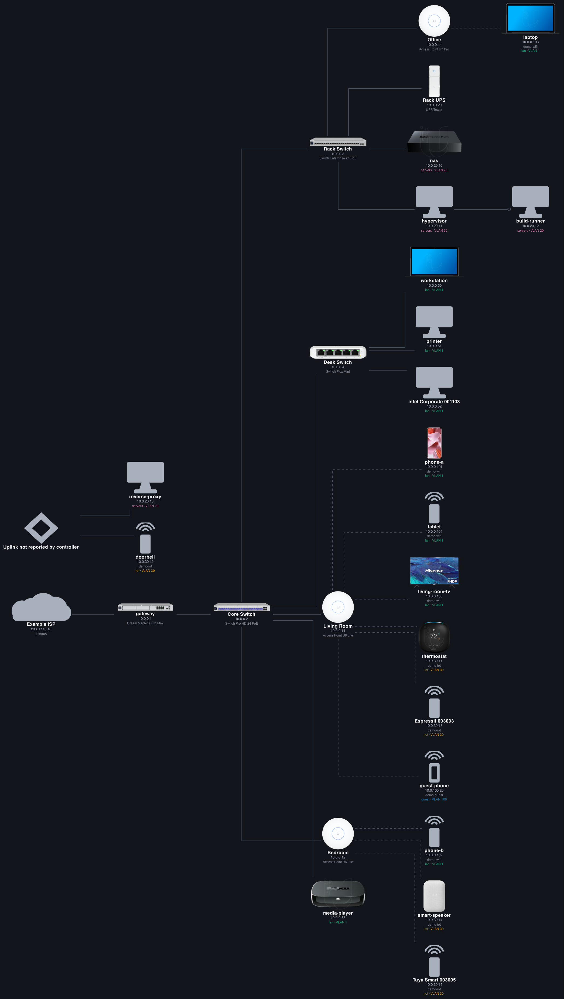
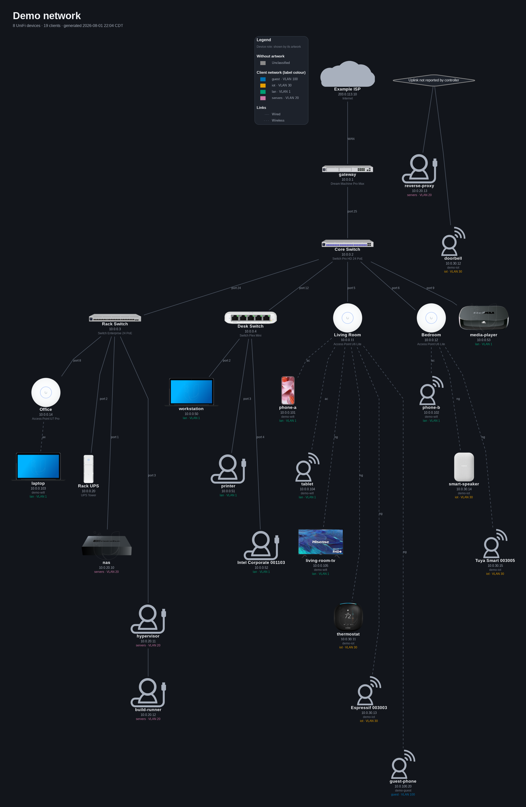

# unifi-map

[](https://github.com/gitkodak/unifi-map/actions/workflows/ci.yml)

Export a UniFi network topology as **zoomable vector diagrams** and **editable
draw.io files**, using real Ubiquiti product artwork.

The UniFi Network web UI has no topology export, and screenshots don't help: the
topology view is a fixed-size viewport wrapping a pan/zoom canvas, so full-page
capture extensions return only the visible region. Zooming out far enough to fit
the whole network is exactly what makes the labels unreadable.

So this doesn't scrape pixels. The UI draws that map from JSON endpoints on the
console; this pulls the same data and renders it properly.



*The defaults, `--layout unifi --theme dark`, which approximate what the console
itself shows: left to right from the Internet, orthogonal links, and no title or
legend because the UniFi UI has neither. Note what a demo can and cannot show
here. The UniFi hardware carries its real artwork, because the dataset holds real
hardware ids, but most of the **clients** are invented and have no fingerprint, so
they fall back to plain shapes. Against a live network, expect nearly all of them
to resolve as well.*



*The same data with `--layout sane`: top down, leaf nodes staggered to keep the
aspect ratio sane, port numbers on the links, and a title block and legend. On a
busy network this is usually the one worth handing to somebody else. Run
`make demo` to reproduce both, then point it at your own controller.*

## Features

- **Maps every client, not just infrastructure.** Gateways, switches, APs and
  everything hanging off them, including clients behind a non-UniFi device.
- **Real Ubiquiti product artwork**, for your hardware *and* your clients, plus
  your ISP's brand mark on the Internet node. [Fetched at runtime and cached,
  never shipped in this repo](#artwork-licensing-and-attribution).
- **Vector output that stays readable.** [SVG and PDF](#output) zoom to any
  size with crisp labels, PNG when something insists, and Graphviz `.dot` to
  tweak by hand.
- **Editable draw.io files**, with real shapes already positioned by Graphviz,
  so you can rearrange the map rather than just look at it.
- **Two layouts.** [`unifi`](#how-close-is---layout-unifi) approximates the
  console's own view; `sane` is top down and actually readable on a busy
  network. Light and dark themes, colourblind-safe palette.
- **Works with no credentials at all**, from a
  [support file](#mapping-from-a-support-file) instead of a controller. Useful
  if you would rather not hand a script an API key, or are mapping a network
  you cannot reach.
- **Safe to publish.** [`--obfuscate`](#sharing-a-map---obfuscate) replaces
  hostnames, addresses, MACs, SSIDs, VLAN names and your ISP, keeping the shape
  of the network intact.
- **One diagram per VLAN**, optionally, each keeping the full gateway and
  switch skeleton so they read as slices of one map.
- **Hides decommissioned hardware** by default, which the console itself offers
  no way to do.
- **[Manual overrides](#manual-overrides), which the console has no equivalent
  of.** Declare a device nothing reports, such as an unmanaged switch; assert a
  link the controller is not in the path of; say that a VM lives on a
  particular host; correct a wrong fingerprint; hide something. All of it drawn
  as a claim rather than an observation, so a reader can tell the difference.
  `make demo-overrides` renders the shipped example.
- **Read-only, always.** `session.get` is the only HTTP verb in the source.

Quickest look, no credentials and no controller:

```bash
make demo
```

Then against your own network:

```bash
install -m 600 .env.example .env    # host + API key, readable only by you
unifi-map all
```

Two things carry risk and are worth reading first: an API key is
[broader than this tool needs](#unifi_api_key), and a support file is
[highly sensitive](#mapping-from-a-support-file).

## How this was built

Essentially all of the code here was written by an AI assistant (Claude), working
from my direction, review, and testing against my own network. 100% vibe-coded.
I decided what it should do and what "good" looked like; it wrote nearly every
line.

It works well for me. It has tests, the design decisions have reasons behind
them, and it has been through two independent security reviews by other AI
systems, whose findings are fixed or recorded. It has not been audited line by
line by a human, and I'm not going to pretend otherwise. It only ever reads from your controller (there is no code
path here that changes anything on it), but it does want admin credentials, so
read `client.py` if that matters to you. It's short.

[`AI_DISCLOSURE.md`](AI_DISCLOSURE.md) is the full version of this: what was
verified, what was not, and how the AI actually failed here, since that is the
part worth knowing. [`HUMAN_INPUT.md`](HUMAN_INPUT.md) records what "my
direction" amounted to, including the times I was wrong. A disclaimer like this
one is worth more when it can be checked.

Use it or don't, your call.

## Output

| Format | Why |
| --- | --- |
| `svg` | Vector. Zoom to any size, labels stay crisp. Artwork is embedded, so it's one portable file. |
| `pdf` | Vector, for printing. |
| `png` | Raster, when something insists on it. |
| `drawio` | Real editable shapes, pre-positioned with Graphviz's layout. Confirmed working in [draw.io](https://app.diagrams.net). Lucid also documents `.drawio` import, though that has not been tried. |
| `dot` | Graphviz source, to tweak styling by hand. |

## Install

```bash
sudo apt install graphviz          # provides `dot` and `unflatten`
python3 -m venv .venv && .venv/bin/pip install -e .
```

Requires Python 3.11+. Graphviz is required; `unflatten` is optional but
improves layout on large networks.

## Credentials

```bash
install -m 600 .env.example .env      # then edit
```

`install -m 600` rather than `cp` on purpose. A plain copy inherits your umask,
which on most systems leaves the file world-readable, and it is about to hold an
API key with your account's permissions. `unifi-map` warns if it reads a
credential file that others can see.

Or set `UNIFI_MAP_ENV=/path/to/credentials` to keep them outside the project.
Files are searched in order: `--env-file`, `$UNIFI_MAP_ENV`, `./.env`,
`~/.config/unifi-map/env`. Real environment variables always win.

```bash
UNIFI_HOST=unifi.example.com
UNIFI_API_KEY=...
UNIFI_SITE=default
UNIFI_VERIFY_TLS=true
```

| Variable | Required | Default | What it is |
| --- | --- | --- | --- |
| `UNIFI_HOST` | yes | | Hostname or IP of the console or controller |
| `UNIFI_API_KEY` | yes | | An API key (see below) |
| `UNIFI_SITE` | no | `default` | Which site to read (see below) |
| `UNIFI_VERIFY_TLS` | no | `true` | `true`, `false`, or a path to a CA bundle |

### `UNIFI_API_KEY`

Create a key in the UniFi OS settings, under the integrations section (the exact
wording moves between versions). This tool only ever reads, so read-only
permission is enough.

A key is the only supported credential. There is no login and no session, so
nothing has to be kept alive or refreshed.

A key inherits the permissions of the account that created it, and UniFi does not
appear to offer a narrower one. `SECURITY.md` explains why, what was tried, and
what this tool actually requests, which is ten GET requests and nothing else.

### `UNIFI_HOST`

Just the host, optionally with a port: `unifi.example.com`, `192.168.1.1`, or
`unifi.example.com:8443`. No path. A scheme is optional and `https://` is
assumed, so `unifi.example.com` and `https://unifi.example.com` are equivalent.

### `UNIFI_SITE`

A UniFi controller can manage several *sites* (separate networks under one
controller). If you have never created a second one, yours is `default` and you
can ignore this.

The catch is that this wants the site's **internal name**, which is not the
label shown in the UI. They are separate fields: on a single-site console the
internal name is `default` while the UI label is `Default`. On a controller
where you created and named sites yourself, the internal name is usually an
opaque short string that looks nothing like the name you typed.

Two ways to find the right value:

- **From the URL.** Open the site in the web UI and look at the address bar. The
  segment after `/site/` is the internal name.
- **Ask the controller.** `GET /proxy/network/api/self/sites` lists every site
  your account can see. Use the `name` field, not `desc`; `desc` is the UI label.

Only a single-site controller has actually been tested, so if you run several
sites and something looks wrong or empty, this variable is the first thing to
check.

### `UNIFI_VERIFY_TLS`

`true` (the default) verifies the certificate normally. Use `false` when you are
connecting to a bare IP, because consoles serve a self-signed certificate there
and verification will fail. Any other value is treated as a path to a CA bundle,
which is what you want if you terminate TLS with a private CA.

If you connect to a bare IP, set this to `false`:

```bash
UNIFI_HOST=192.168.1.1
UNIFI_VERIFY_TLS=false
```

### Legacy variable names, deprecated

Every variable also answers to a `UDM_*` spelling: `UDM_HOST`, `UDM_API_KEY`,
`UDM_SITE`, `UDM_VERIFY_TLS`. If both are set, the `UNIFI_*` one wins.

These exist only because that is what the author had called things before this
tool did. **They still work and will be removed in a future version**, so rename
them when convenient. Using one prints a warning naming the replacement.

No removal version is promised. Everything about this interface may change
before 1.0.

`UNIFI_MAP_ENV` is not read from the credential file itself; it is the
environment variable that says *where* the credential file is.

Tested against UniFi Network 10.5.67 on a UDM Pro Max, with a single site.

## Try it without touching your network

A synthetic dataset ships in `examples/demo/`, so you can see the output before
pointing this at real infrastructure. No credentials, no controller:

```bash
make demo
# or:
unifi-map --cache-dir examples/demo --out-dir out/demo render --per-network
```

Every MAC, address and hostname in it is invented. Some identifiers are
deliberately real, because they are what artwork lookup joins on:

- **Hardware `sysid` values are real**, so every UniFi device in the demo draws
  its actual product artwork.
- **A few client `dev_id` values are real** (a laptop, a phone, a TV, a
  thermostat and so on), so those clients get real artwork too.

The rest of the clients are pure invention with no fingerprint, so they render as
plain shapes. That is the demo being honest rather than a defect: made-up devices
cannot have product artwork. The generic icon-font glyph is not available either,
because that font comes from a live controller. Against a real controller both
gaps close, and coverage is usually near total.

The dataset deliberately includes an offline device, four VLANs, and a client the
controller cannot place, so those behaviours are visible too.

An example overrides file ships alongside it at `examples/demo/overrides.toml`,
exercising every block against that data. `make demo-overrides` renders it, and
comparing the two outputs shows what each override actually changes.

Regenerate the dataset with `make demo-snapshot` (see
`scripts/make_demo_snapshot.py`).

## Mapping from a support file

If you would rather not hand this tool an API key, or you want to map a network
you cannot reach, point it at a console support file instead. There are no
credentials involved and nothing touches the network:

```bash
unifi-map all --support-file support-XXXX-1234567890.tgz
```

Generate one in the console under **Settings > System > Support File**. It is a
large archive, typically around 150 MiB.

> **Treat a support file as a secret.** It is one of the most sensitive things
> your console can produce. It contains every MAC address, hostname, IP and DHCP
> lease on your network, your SSIDs, VLANs and subnets, your public WAN
> addresses and ISP, and extensive logs including per-client connection history.
>
> UniFi does redact *some* credentials on the way out, but the filter matches on
> field **names** with regular expressions, so anything it does not recognise
> passes through. On one real support file, most credential fields were indeed
> filtered while a set of unredacted access tokens remained.
>
> So do not ask whether one particular secret is in there. Assume anything the
> console knows may be. Keep it encrypted, do not attach it to a ticket or paste
> it into a chat, and delete it when you are done. `SECURITY.md` goes into more
> detail.
>
> This tool reads only seven files out of the archive and never unpacks it, but
> that limits *this tool*, not the file.

Sending one to someone else is therefore a bigger favour than it looks. If the
question is really about topology, an obfuscated render is usually a better
thing to hand over:

```bash
unifi-map all --support-file support-XXXX.tgz --obfuscate
```

**Reading a support file contacts nothing.** No controller, no credentials, and
no outbound requests of any kind. If you want client product artwork, that needs
Ubiquiti's fingerprint database, which the archive does not contain, so it is a
separate opt-in:

```bash
unifi-map fetch --support-file support-XXXX.tgz --fetch-fingerprints
```

That downloads about 1 MB from Ubiquiti's CDN and caches it, still without
touching any controller. Leave the flag off and clients simply draw without
product artwork. Note that `render` does reach the CDN for device artwork unless
you pass `--offline`, so for a completely network-free run use both:

```bash
unifi-map all --support-file support-XXXX.tgz --offline --icons builtin
```

What you get is very close to a live fetch. Verified against the same network
read both ways, the infrastructure and the wireless client list came out
identical, and VLAN names, subnets, switch port numbers, SSIDs, client addresses,
the ISP name and Protect camera artwork all survive.

**Client artwork is much reduced.** This is the one place a support file is
clearly worse, and it is worth being concrete: on the network this was developed
against, an API key resolved product artwork for **42 of 48** clients, and a
support file managed **13 of 47**. Roughly a third.

A support file does not store the fingerprint id that client artwork is matched
on. Some of it can be reconstructed, because a client the console named *itself*
is named after the product it identified, and that name can be looked back up.
But the console only does that for a client that sent no DHCP hostname and that
you never renamed, which on a real network is a minority. Everything else draws
without product artwork.

So expect a support-file map to have correct names, addresses and connections
throughout, and product icons on a minority of clients. UniFi hardware appearing
as a client is unaffected and still draws properly.

The product lookup needs Ubiquiti's published fingerprint database, which is why
it is behind `--fetch-fingerprints` as described above. Clients with no
fingerprint draw as plain shapes unless you also supply the glyph font, below.

### The generic client glyph, and why it is awkward

Clients the console never identified get a generic person or laptop glyph in the
UniFi UI. That glyph is not an image: it is a character in a custom icon font
that **only a controller serves**. Ubiquiti publish the device artwork and the
fingerprint database, but not this font, so there is no route to it that avoids a
controller entirely. It is also their property, so this project will not ship a
copy.

Three options, with what each costs:

| | Needs an API key | Needs network | Result for unidentified clients |
| --- | --- | --- | --- |
| Do nothing (default) | No | No | Plain shapes |
| `--icon-font DIR` | No | No | Real UniFi glyphs |
| `--fetch-icon-font` | **Yes** | Yes | Real UniFi glyphs |

Plain shapes are a perfectly readable diagram; they are colour and shape coded
like everything else. This is presentation, not information.

**`--fetch-icon-font`** asks a controller directly, so it needs `UNIFI_HOST` and
`UNIFI_API_KEY` exactly as a live `fetch` does. If you are reading a support file
specifically to avoid connecting to a console, this defeats that, which is why it
is off by default and named plainly. It is still useful when the support file is
someone *else's* and you have a console of your own: any UniFi controller's font
works, since the glyphs are not site-specific.

**`--icon-font DIR`** reads a copy you obtained yourself, and touches nothing.
You need two files, the stylesheet and the `.ttf`, because the codepoints live in
the CSS rather than the font:

```bash
unifi-map all --support-file support-XXXX.tgz --icon-font ~/ubnt-icon
```

Point it at a directory containing both, in any arrangement. To get them, either
copy them off a self-hosted controller, where the UI directory is logged at
startup as `uiDir` and is normally:

```text
/usr/lib/unifi/webapps/ROOT/app-unifi/angular/<build>/fonts/ubnt-icon/
```

(On a UniFi OS console such as a UDM or UNVR the Network application runs in a
container, so that path is inside it rather than on the host filesystem.)

Or download them over HTTP, which needs an API key once but then never again:

```bash
BUILD=$(curl -s -H "X-API-KEY: $UNIFI_API_KEY" \
  "https://$UNIFI_HOST/proxy/network/manage/" | grep -o 'angular/[A-Za-z0-9]*' | head -1)
mkdir -p ~/ubnt-icon/fonts
BASE="https://$UNIFI_HOST/proxy/network/manage/$BUILD/fonts/ubnt-icon"
curl -s -H "X-API-KEY: $UNIFI_API_KEY" "$BASE/style.css"      -o ~/ubnt-icon/style.css
curl -s -H "X-API-KEY: $UNIFI_API_KEY" "$BASE/fonts/ubnt.ttf" -o ~/ubnt-icon/fonts/ubnt.ttf
```

Either way the font is cached under `--asset-cache` afterwards, so the flag is
only needed once per cache.

Two smaller caveats:

- Client addresses come from the gateway's DHCP leases and neighbour table, so a
  client that never took a lease and had gone quiet may have no address shown.
- Only the LAN networks appear. The controller's live network list also includes
  WAN and VPN entries, which no client belongs to and which nothing draws.

For a console with more than one site, the largest is mapped and a warning says
so; pass `--support-site NAME` to choose another.

Only seven files are ever read out of the archive, as a stream. It is never
unpacked, which matters because a support file also contains extensive logs.

Reading one is capped three ways, since the whole point is that somebody else
can send you one. Two cap what is decoded into memory, and the third caps how
much of the archive is walked, which is a separate concern because entry count
does not follow the bytes decoded.

| Flag | Default | Guards against |
| --- | --- | --- |
| `--support-max-member` | 64M | one huge member decompressed on trust |
| `--support-max-total` | 128M | many members that are individually fine |
| `--support-max-entries` | 100000 | an archive that is cheap to decompress and enormous to iterate |

```bash
unifi-map all --support-file support-XXXX.tgz \
  --support-max-member 256M --support-max-total 512M
```

The sizes accept a plain byte count or a `K`, `M` or `G` suffix, and every one
of the three errors names the flag to raise.

The defaults come from a single 154M archive off a UDM Pro Max, whose largest
relevant member was 400K and which held about 2,500 entries. That is one sample
of one small network, so treat the headroom as a guess rather than a measured
safety margin: it says nothing about how any of these numbers grow with site
size. All three are therefore adjustable. If you hit one legitimately, please
open an issue saying so, because a second data point would be worth more than
the reasoning that picked these.

## Usage

```bash
unifi-map all                              # fetch + render
unifi-map fetch                            # snapshot the controller into cache/
unifi-map fetch --support-file FILE.tgz     # or read a support file instead
unifi-map render                           # render from the cached snapshot
unifi-map render --per-network              # one diagram per VLAN as well
unifi-map render --no-clients               # infrastructure only
unifi-map render -f svg pdf drawio dot      # pick formats
```

`fetch` and `render` are separate on purpose: you can re-render endlessly while
adjusting style without hammering the controller, and each cached snapshot is a
record of what the network looked like at that moment.

### What actually touches the network

Worth being precise about, because there are two caches and they behave
differently:

| Command | Controller | Artwork |
| --- | --- | --- |
| `fetch` | Always. Never checks the cache first, so it always overwrites the snapshot with current state. | Fetches the icon font if it is missing |
| `render` | Never. Reads whatever snapshot is in `--cache-dir`, however old. | Downloads any artwork not already cached, unless `--offline` |
| `all` | Always, because it is `fetch` then `render` | Same as `render` |

So `unifi-map all` does not skip the fetch when a cache already exists; it
refreshes unconditionally. If you want to re-render without going near the
controller, use `render`.

And `render` is not automatically offline. On a cold artwork cache it reaches
Ubiquiti's CDN for product images. Pass `--offline` to forbid that, or
`--icons builtin` to avoid needing artwork at all. Once the artwork cache is
warm, `render` makes no network calls in practice, but that is a consequence of
the cache being populated rather than a guarantee of the command.

### When something looks wrong: `-v`

```bash
unifi-map -v render
```

Verbose mode logs every artwork lookup, including the ones that came back
empty. That is usually enough to tell the two common cases apart:

- **Ubiquiti has no artwork for that device.** The lookup ran and the asset
  genuinely is not published. Nothing to fix here; the shape or glyph fallback
  is correct.
- **The match went wrong.** The device resolved to the wrong product, or to
  nothing when it should have resolved. [Overrides](#manual-overrides) can
  correct it, and it is worth reporting.

Missing artwork is deliberately quiet at the normal log level, because a
handful of unrecognised devices is ordinary on any network and a warning per
device would drown the output. `-v` is where the detail lives.

It also raises the detail on everything else, so it is the first thing to
attach to a bug report. Redact addresses and hostnames before pasting.

### Overwriting: `--force`

Rendering refuses to replace a `.dot` or `.drawio` it did not write, so a
diagram you have opened and rearranged is left alone rather than silently
replaced. Re-rendering output it recognises as its own needs no flag.

```bash
unifi-map render --force        # replace it anyway
```

PNG, PDF and SVG are not guarded. Nothing hand-authors one at exactly that path,
and there is nowhere convenient in them to record that this tool produced it.

### Style options

```bash
--icons unifi|builtin      # default: unifi
--layout unifi|sane        # default: unifi
--theme light|dark         # default: light
```

**Defaults reproduce the UniFi web view.** Out of the box you get what the
console shows you, just exportable and zoomable. The one deliberate exception is
`--show-offline`, below.

**`--icons unifi`** uses real Ubiquiti product artwork for both UniFi hardware
*and* clients (the same images the topology view shows). Fetched on first run and
cached. **`--icons builtin`** uses geometric shapes only: no network access, no
external assets.

**`--layout unifi`** approximates the UniFi UI: left-to-right tree, orthogonal
links, no port labels, no title or legend chrome, canvas trimmed to the drawing.
See below for how close that actually gets.
**`--layout sane`** is top-down with leaf staggering, port numbers on links, a
title block and a legend, built to actually be readable on a busy network. Try
both; on a network with many clients `sane` is usually the one you want to hand
to someone else.

### How close is `--layout unifi`?

Close, not exact. It won't look *exactly* like the controller UI, and it can't:
the tooling necessarily leaves its mark on the output. I've made my best attempt
to get as close as possible.

Concretely, what differs:

- **Graphviz does the layout, not UniFi.** The tree is connected the same way, but
  the order siblings appear in and the precise spacing are Graphviz's decisions.
- **Link routing is orthogonal but not identical.** Corners, channel spacing and
  where a line breaks are up to the renderer.
- **Fingerprints are sometimes wrong.** Client artwork comes from Ubiquiti's
  fingerprint database, and it misidentifies things (a phone shown as an
  appliance, that sort of thing). That is upstream data, not a rendering bug;
  correcting it is what the planned overrides are for.
- **Typography and label content differ.** This uses Helvetica/Arial and shows
  name, address and product name; the UI has its own font and its own idea of
  what belongs on a node.
- **It's a static picture.** No hover, no expanding and collapsing, no live state.

If you need the real thing, the real thing is in your browser. This is for when
you need it in a file.

**`--show-offline yes|no`** (default `no`) controls whether devices the
controller still lists but that aren't connected appear. This is the one place
the defaults deviate from the web view, on purpose: a controller keeps
remembering hardware long after it's been pulled from the rack, and the UI gives
you no way to hide it. Use `yes` to see everything yours still thinks exists.

Further knobs: `--legend` / `--no-legend`, `--title-block` / `--no-title-block`,
`--stagger N` (aspect-ratio control for `sane`), `--offline` (never touch the
network for artwork), `--title`, `--name`, `--out-dir`, `--cache-dir`,
`--asset-cache` (artwork cache, kept separate from snapshots).

## Reading the diagram

Colour is never the only signal. The accent palette is
[Okabe-Ito](https://jfly.uni-koeln.de/color/), chosen to stay separable under
red-green colour blindness, and every distinction is *also* carried by artwork,
shape, or line style, so the diagram survives greyscale printing.

| Element | Encoding |
| --- | --- |
| UniFi device | Real product artwork, matched on hardware `sysid` |
| Client | Real product artwork, matched on fingerprint `dev_id` |
| UniFi hardware appearing as a client | Its catalogue artwork, matched by hostname (see below) |
| Unrecognised client | A generic user/guest x wired/wireless glyph, the same fallback the UI uses |
| Client network | Border colour, plus the VLAN in the label |
| Wired link | Solid line |
| Wireless link | Dashed line |
| Offline device | Dashed border, `OFFLINE` in the label |

With `--layout sane`, edge labels are switch port numbers (`port 12`) or the
radio for wireless clients.

The legend only lists what a given render actually encodes. A node drawn as
artwork has no border and no fill, so it carries no accent colour and gets no
role swatch; its role is the artwork. Swatches appear only for roles that fell
back to shapes in that render, under "Without artwork". `--layout unifi` omits
the legend entirely, matching the UniFi UI.

### "Uplink not reported by controller"

You will probably never see this node, but it exists for the case where the
controller genuinely does not know where something is attached.

`stat/sta` only reports a client's uplink when that uplink is a UniFi device, so
anything behind a non-UniFi box (VMs and containers behind a NAS, or a client on
an unmanaged switch) comes back with no `sw_mac` at all. Those are resolved
against the controller's own topology graph, where a client can be another
client's uplink, which is how the console draws them correctly.

Anything still unresolved after that is anchored to an explicit placeholder,
rather than left floating (which looks like a bug) or attached to a guessed
parent (which would invent a connection that does not exist).

## Sharing a map: `--obfuscate`

A rendered map is not anonymous. Labels carry hostnames, addresses, VLAN names
and your WAN address, and an SVG holds all of it as selectable text. That makes
it awkward to ask for help with a layout problem.

```bash
unifi-map render --obfuscate --theme dark
```


*A real network, obfuscated. Every device is a pseudonym, addresses are
renumbered, and the connections, roles and port numbers are untouched. Product
artwork stays, because it says what a device is rather than whose it is; the one
exception is the ISP, whose brand mark is replaced by the generic cloud on the
Internet node. Note `client-11`, with four clients hanging off it rather than off
a switch: those are VMs behind a NAS, which `stat/sta` cannot place and the
controller's own graph can.*

**Replaced:** hostnames and device names, IP addresses, MAC addresses (including
the node identifiers in the DOT and draw.io output, which are derived from them),
network and VLAN names, SSIDs, the ISP name and the WAN address.

**Kept**, because otherwise the result is useless for the purpose: how everything
is connected, device roles, models and artwork, port numbers, counts, and which
clients sit on which network. Addresses are renumbered but stay grouped, so the
VLAN structure is still visible.

Pseudonyms are stable. The same device is `client-07` in every render of the same
snapshot, so a follow-up screenshot lines up with the first. They are assigned by
a fixed ordering rather than derived from the real name, since a hash of a short
hostname is trivially reversible.

### Logs, and what `-v` reveals

`--obfuscate` covers the diagram *and* the ordinary log output, so a scrubbed
render is not accompanied by a terminal full of real names. There is a test that
renders an identifying fixture and checks the captured log for every value it
knows about.

`-v` is the exception, deliberately. Verbose mode exists to explain why an
individual device did not match, which means naming it. Do not paste `-v` output
from a real network into a public issue.

### What it does not hide

Two things worth understanding before you post a map publicly:

- **The artwork still shows what your devices are.** A TV, a thermostat, a NAS
  and a games console are all recognisable from their pictures, and some carry
  brand marks. If that matters, add `--icons builtin` for geometric shapes and no
  artwork at all.
- **`--title` is yours.** If you pass a title containing your name or your
  network's name, it will be rendered exactly as given. The default is a neutral
  "Network map".

This runs on the model before anything is drawn, so no renderer can leak a value
that has already been removed. A test renders SVG, DOT and draw.io and asserts
that not one original hostname, address, MAC, network name or SSID appears in any
of them, because a mode that cleans one format and leaves another readable would
be worse than none at all.

## Fixing a wrong icon in the console instead

Before reaching for an overrides file, try the console. UniFi lets you change a
client's device fingerprint in its settings, and **this tool already follows
that**: a client's `dev_id_override` is preferred over the fingerprint the
controller guessed. Correct it once in the console and every render afterwards
picks it up, with nothing to configure here.

The catch is the console's own picker, which is small and only matches from the
start of a name. Searching "Apple iPhone" finds something; "iphone" finds
nothing.

Two community tools make that searchable, both browser-side:
[hubaker/UniFi-Icon-Browser](https://github.com/hubaker/UniFi-Icon-Browser) and
the more actively extended fork
[CANTI-BOT/UniFi-Icon-Browser](https://github.com/CANTI-BOT/UniFi-Icon-Browser),
which adds partial-match search across roughly 5,500 icons and works with
self-hosted controllers. Neither is affiliated with this project.

Overrides are still the answer when you have no console access, when the device
you want is not in Ubiquiti's catalogue at all, or when you want artwork of your
own.

## Manual overrides

Things a controller cannot tell you, which you can state in an
`overrides.toml` (picked up automatically when it exists, or pass `--overrides`):

```toml
# A device nothing reports: an unmanaged switch, a non-UniFi access point, or
# something that was powered off when you ran the fetch. `parent` and `port`
# are optional; without them it floats.
[[device]]
name = "Basement dumb switch"
kind = "switch"            # gateway, switch, ap, bridge, wired_client,
                           # wireless_client or unknown
ip = "10.0.0.9"            # optional
model = "NETGEAR GS308"    # optional, shown under the name
parent = "Core Switch"     # optional, any selector: MAC, IP or name
port = 24                  # optional, needs a parent
icon = "netgear.png"       # optional, your own artwork

# A link the controller is not in the path of.
[[link]]
from = "nas"
to = "Rack Switch"
port = 10
speed = "10G"

# Something running inside something else.
[[hosted]]
guest = "build-runner"
host = "hypervisor"
note = "VM"

# A wrong fingerprint, corrected. Ubiquiti's database is confident and
# sometimes wrong: mine insists my network-attached bidet is a smart
# toothbrush.
[[node]]
match = "10.0.30.22"
name = "Network Bidet"
icon = "assets/bidet.png"

# Devices you declared can be referenced anywhere a selector is accepted,
# including by other declared devices, so a chain works.

# Something you would rather not draw at all.
[[node]]
match = "Garage"
hide = true
note = "radios disabled on purpose, online but doing nothing"
```

Selectors are tried as a MAC address, then an IP, then the label on the map. One
that matches nothing, or several nodes, stops the run rather than being ignored.

Anything you assert is drawn **dotted**, and the legend says so, so a claim of
yours is never mistaken for something the controller reported.

Only leaf nodes can be hidden. Hiding a switch would orphan everything behind it,
and there is no honest answer to what should happen to the children, so it is
refused with an error naming them.

Artwork you supply is fitted into the same box as everything else, so it cannot
come out oversized, but **trim the empty margins yourself**: fetched artwork is
cropped to its visible content automatically and yours is not, so a subject
floating in a large canvas renders noticeably smaller than its neighbours. A
roughly square, tightly cropped, transparent PNG around 256 pixels on the long
edge matches Ubiquiti's own artwork best.

See [`docs/overrides.md`](docs/overrides.md) for the full format and more
guidance on choosing images.

**Anything you state is drawn as a claim, not as an observation.** Declared
devices get a dotted outline and asserted links a dotted line, and the legend
gains a "Stated in overrides" entry. Offline gear uses dashes rather than dots,
so the two stay distinguishable, and neither relies on colour. The point is that
a reader of your diagram can tell which parts the controller reported and which
parts you typed in.

## Also planned

- **An infrastructure view** alongside the topology view: gateway, switches, APs
  and their uplinks presented as a rack/cabling diagram rather than a client
  tree. `--no-clients` is a rough approximation of this today.

## Artwork, licensing and attribution

This repository contains **no** Ubiquiti artwork. Device images are Ubiquiti's
intellectual property; they are fetched at runtime from Ubiquiti's public
endpoints and cached under `cache/`, which is gitignored. Nothing is
redistributed here.

If you'd rather not fetch anything, use `--icons builtin`.

UniFi and Ubiquiti are trademarks of Ubiquiti Inc. This project is not
affiliated with or endorsed by Ubiquiti.

The code is MIT licensed; see [LICENSE](LICENSE).

## How it works

### Where the artwork comes from

Three separate sources, none of them vendored here:

| What | Source | Key |
| --- | --- | --- |
| UniFi hardware | `static.ui.com/fingerprint/ui/public.json` + `.../ui/images/...` | hardware `sysid` |
| Clients | `static.ui.com/fingerprint/0/{dev_id}_257x257.png` | fingerprint `dev_id` from `stat/sta` |
| UniFi gear seen as a client | the same catalogue as UniFi hardware | hostname, plus a device type from another app |
| Generic client glyphs | the controller's own icon font (`fonts/ubnt-icon`) | user/guest x wired/wireless |

The client artwork endpoint is `staticFingerprintOld` in the Network UI's own
config. The controller also serves the fingerprint database itself at
`/proxy/network/v2/api/fingerprint_devices/0` (5789 devices), which is what turns
an unnamed client into "Govee H61E1 / Smart Light Strip".

Note that the controller does **not** host device images: every path under its
web app's static assets returns the SPA's HTML 404. Only the icon font is local.

### UniFi hardware that appears as a client

A UniFi device on a switch port that the Network app has not adopted (a Protect
camera, for example) is just a client: no fingerprint, so nothing to look up. Its
hostname is the only handle, and hostnames are ambiguous. `g3-flex` matches both
`UVC-G3-FLEX`, a Protect camera, and `UA-G3-Flex`, an Access door reader.

So the hostname is matched against the hardware catalogue, and a match is only
used when it is unique. To break ties, other UniFi apps are asked what they know:
if Protect reports that MAC as a camera, only camera entries are considered, and
`g3-flex` then resolves to exactly one. If a name stays ambiguous, the generic
glyph is used rather than a coin flip.

This needs no extra configuration. `/proxy/protect/integration/v1/cameras` is
fetched when present and ignored when Protect is not installed.

### Matching

Devices are matched to Ubiquiti's device catalog on **sysid**, not model name:
the controller's `model` string doesn't reliably match the catalog's shortnames
(a USW Pro HD 24 PoE reports `USWED72` while the catalog calls it `USPH24P`).

The graph is built from `stat/device` uplinks plus `stat/sta` and `networkconf`,
then completed with the controller's own `v2/.../topology` graph for clients the
first two cannot place. That endpoint is read defensively, since it is a v2 API
whose structure has changed before: anything unexpected in it yields nothing
rather than raising, so a controller upgrade degrades the map instead of breaking
the run.

## What has been checked, and what has not

Some of this is observed behaviour and some of it is reasonable inference. The
difference matters if you hit a problem, so:

**Checked directly**, against UniFi Network 10.5.67 on a UDM Pro Max:
authentication, every endpoint used, artwork lookup for both UniFi hardware and
clients, the icon font fallback, both layouts, both themes, all five output
formats, the offline and no-artwork paths, and opening the generated `.drawio`
in draw.io.

**Not checked:**

- **More than one site.** The test console has a single site. The advice above
  about internal site names comes from how UniFi behaves generally, not from
  something observed here, which is why it points you at the URL and the API
  rather than telling you what the value will look like.
- **Importing into Lucid.** Lucid documents `.drawio` import; that has not been
  tried with a file from this tool.
- **Any controller other than a UDM Pro Max**, or any Network version other than
  10.5.67. Older or newer controllers may move or reshape these endpoints.

If any of these turn out to be broken, that is a bug worth reporting rather than
a known limitation.

## Caveats

- Only **active** clients appear. A powered-off device isn't in `stat/sta` and
  won't be on the map.
- Wireless client counts drift between runs as devices roam and sleep. Two
  snapshots minutes apart won't match exactly; that's the network, not a bug.
- `cache/` holds a MAC, hostname and IP inventory of every device on your
  network. It's gitignored and written `0600`. Don't commit it or paste it into
  an issue.
