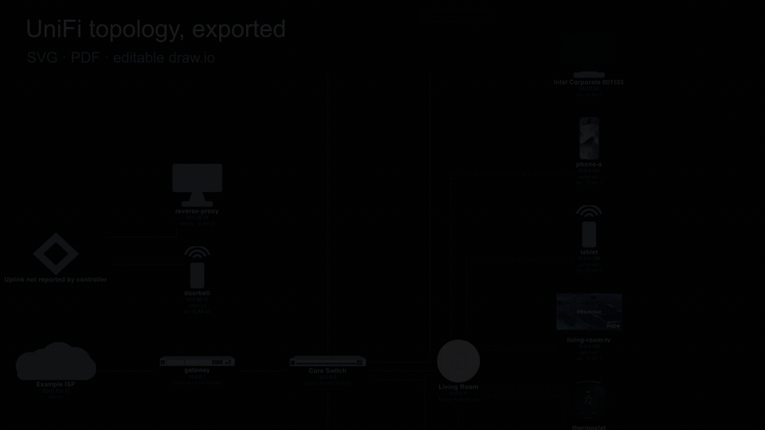
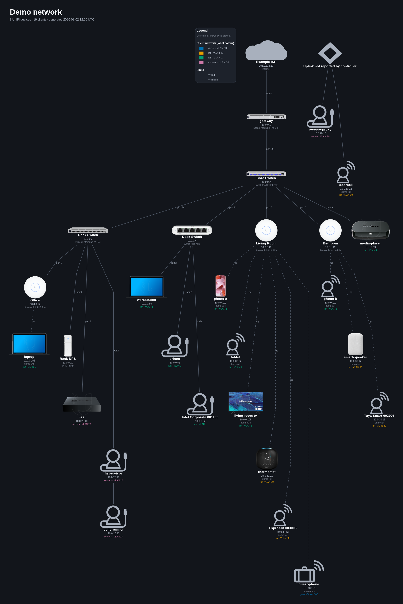

# unifi-map

[](https://github.com/gitkodak/unifi-map/actions/workflows/ci.yml)
[](https://sonarcloud.io/summary/new_code?id=gitkodak_unifi-map)
[](https://sonarcloud.io/summary/new_code?id=gitkodak_unifi-map)

Export a UniFi network topology as **zoomable vector diagrams** and **editable
draw.io files**, using real Ubiquiti product artwork.

The UniFi Network web UI has no topology export, and screenshots don't help: the
topology view is a fixed-size viewport wrapping a pan/zoom canvas, so full-page
capture extensions return only the visible region. Zooming out far enough to fit
the whole network is exactly what makes the labels unreadable.

So this doesn't scrape pixels. The UI draws that map from JSON endpoints on the
console; this pulls the same data and renders it properly.



**This is a UniFi Network tool.** It reads one Protect endpoint, purely to tell
a camera from an Access reader when the hardware names collide, and touches
nothing else in the suite. Access readers and Talk phones still appear, as
ordinary clients, and a UNAS should appear as ordinary UniFi hardware, though
none of those has been seen here and the last is inference. Either way nothing
here knows what they are beyond what Network reports.
[What that costs, and what would fix it](docs/verification.md#which-unifi-applications-this-has-seen).


*The default layout, `--layout unifi`, which approximates what the console
itself shows: left to right from the Internet, orthogonal links, and no title or
legend because the UniFi UI has neither. Note what a demo can and cannot show
here. The UniFi hardware carries its real artwork, because the dataset holds
real hardware ids. Eight of the **clients** resolve to real product renders; the
rest are invented, have no fingerprint, and fall back to the console's own
generic glyphs, which is the same thing the UniFi UI does with them.

Those glyphs need the icon font, which only a controller serves, so a clone of
this repository draws our own client icons there instead until it has one. See
[the generic client glyph](docs/artwork.md#the-generic-client-glyph-and-why-it-is-awkward)
for the three routes to it. Against a live network, expect nearly every client
to reach a real product render.

Screenshots here use `--theme dark` because they read better against this page.
**The tool defaults to `--theme light`**, and a
[light version of this map](docs/images/example-unifi-light.png) is committed
alongside every other one, so you can see what an unmodified run produces.*



*The same data with `--layout tree`: top down, leaf nodes staggered to keep the
aspect ratio reasonable, port numbers on the links, and a title block and legend. On a
busy network this is usually the one worth handing to somebody else.
([Light version](docs/images/example-tree-light.png).) Run `make demo` to
reproduce both; [Install](#install) is what you need before pointing it at your
own controller.*

## Features

- **Maps every active client, not just infrastructure.** Gateways, switches, APs and
  everything hanging off them, including clients behind a non-UniFi device.
- **Real Ubiquiti product artwork**, for your hardware *and* your clients, plus
  your ISP's brand mark on the Internet node. [Fetched at runtime and cached,
  never shipped in this repo](docs/artwork.md#artwork-licensing-and-attribution).
  Anything it cannot identify falls back to
  [an icon drawn by this project](docs/artwork.md#the-icons-we-draw-ourselves)
  rather than a bare shape, so `--icons builtin` needs no network at all.
- **Vector output that stays readable.** [SVG and PDF](#output) zoom to any
  size with crisp labels, PNG when something insists, and Graphviz `.dot` to
  tweak by hand.
- **Editable draw.io files**, with real shapes already positioned by Graphviz,
  so you can rearrange the map rather than just look at it.
- **Two layouts.** [`unifi`](docs/usage.md#how-close-is---layout-unifi) approximates the
  console's own view; `tree` is top down and actually readable on a busy
  network. Light and dark themes, colourblind-safe palette.
- **Works with no credentials at all**, from a
  [support file](docs/support-files.md#mapping-from-a-support-file) instead of a controller. Useful
  if you would rather not hand a script an API key, or are mapping a network
  you cannot reach.
- **Safe to publish.** [`--obfuscate`](docs/sharing.md#sharing-a-map---obfuscate) replaces
  hostnames, addresses, MACs, SSIDs, VLAN names and your ISP, keeping the shape
  of the network intact.
- **One diagram per client network**, optionally, each keeping the full gateway
  and switch skeleton so they read as slices of one map.
- **Hides decommissioned hardware** by default, which the console itself offers
  no way to do.
- **[Manual overrides](docs/overrides.md), which the console has no equivalent
  of.** Declare a device the controller cannot see, such as a switch it does
  not manage; assert a
  link the controller is not in the path of; say that a VM lives on a
  particular host; correct a wrong fingerprint; hide something. All of it drawn
  as a claim rather than an observation, so a reader can tell the difference.
  `make demo-overrides` renders the shipped example.
- **Read-only, always.** `session.get` is the only HTTP verb in the source.
- **Scriptable by default.** The [progress spinner](docs/output.md#progress-and-turning-it-off)
  turns itself off whenever output is not a terminal, so piping or redirecting
  produces clean text with no escape sequences and no `--no-progress` to
  remember.

Quickest look, no credentials and no controller. From a clone, with Graphviz
and Python 3.11+ present ([Install](#install) covers both):

```bash
make demo
```

That builds its own virtual environment and renders the shipped dataset
straight into `examples/demo/`, alongside the input it was rendered from.
The renders are gitignored by extension; the input is not.

**To run it against your own network, start at [Install](#install).** You need
the tool on your `PATH` and a credential file holding your host and API key,
and neither exists yet at this point.

Two things carry risk and are worth reading first: an API key is
[broader than this tool needs](docs/credentials.md#unifi_api_key), and a support file is
[highly sensitive](docs/support-files.md#mapping-from-a-support-file).

## How this was built

Essentially all of the code here was written by an AI assistant (Claude), working
from my direction, review, and testing against my own network. I decided what it
should do and what "good" looked like; it wrote nearly every line.

It works well for me. It has tests, the design decisions have reasons behind
them, and it goes through regular independent review by other AI systems
covering security, documentation, code and architecture, whose findings are
fixed or recorded. It has not been audited line by line by a human, and I am
not going to pretend otherwise.

It only ever reads from your controller, and there is no code path here that
changes anything on it. It does want admin credentials, so read `client.py` if
that matters to you. It is short.

[`AI_DISCLOSURE.md`](AI_DISCLOSURE.md) is the full version of this: what was
verified, what was not, and how the AI actually failed here, since that is the
part worth knowing. [`HUMAN_INPUT.md`](HUMAN_INPUT.md) records what "my
direction" amounted to, including the times I was wrong. A disclaimer like this
one is worth more when it can be checked.

Judge it on that basis.

## Output

Vector `svg` and `pdf`, `png` when something insists on it, Graphviz `dot` to
tweak by hand, editable `drawio`, `html` for a searchable pan-and-zoom viewer,
`mermaid` for a page that renders it in place, and `json` for programs. [What
each is for](docs/output.md).

## Install

```bash
sudo apt install graphviz          # provides `dot` and `unflatten`
python3 -m venv .venv && .venv/bin/pip install -e .
source .venv/bin/activate          # puts `unifi-map` on your PATH
```

**That last line matters.** Installing into a virtual environment puts the
command at `.venv/bin/unifi-map` and nowhere else, so without activating it
every `unifi-map ...` example here and under `docs/` is a `command not found`.
Either activate it, as above, or spell the path out in full. The `make` targets
are unaffected; they call the venv's copy directly.

Requires Python 3.11+. Graphviz is required for the graphical formats, which
are the defaults: `svg`, `pdf`, `png`, `html` (it embeds a rendered SVG) and the
positions inside a `drawio` file. `dot`, `mermaid` and `json` are written
directly and need nothing installed. `unflatten` is optional but improves
layout on large networks.

### If you supply your own SVG artwork

Either install the extra:

```bash
pip install -e ".[svg]"
```

Only relevant if you point an [override](docs/overrides.md) at an `.svg` file
for a device's icon. Without the extra, Graphviz loads SVG artwork **only for
the `svg` output**: `png` and `pdf` go through cairo, which has no SVG loader,
so the icon is silently dropped from both. The tool warns when that is about to
happen and names the file.

With the extra, an SVG is rasterised to a cached PNG on the way in, so it
reaches every format, and a file that lacks the XML declaration Graphviz
insists on works untouched.

**Or convert the file to PNG, which needs no dependency at all.** Either answer
is fine: the extra if you keep editing the artwork or have several of them, a
conversion if you would rather not add one. PNG override artwork needs none of
this either way.

### Installing it somewhere else

`make build` produces a wheel and an sdist in `dist/`, which install anywhere
without a checkout:

```bash
make build
pip install dist/*.whl             # here, or copy the wheel to another machine
```

Useful for putting the tool on a box that should not carry the source. Graphviz
is still a system dependency; a wheel cannot bring it along.

There is **no published package**, so `pip install unifi-map` does not work and
is not meant to. Whether this should ever own a name on PyPI is an open
question rather than an oversight, because publishing is the part that cannot be
withdrawn once somebody depends on it.

A man page is committed as `unifi-map.1`, so it works straight from a clone
without installing anything:

```bash
man ./unifi-map.1
```

It is generated from the argument parser by `make docs`, and `make check` fails
if it has gone stale.

### Installing from GitHub, no checkout needed

`pip install git+https://...` against a tag, or a release wheel by URL, both
work with no PyPI account involved. See
[Installing from GitHub](docs/install-from-github.md) for both, and for how
`man unifi-map` reaches you either way from 0.10.0 on.

## Try it without touching your network

A synthetic dataset ships in `examples/demo/`, so you can see the output before
pointing this at real infrastructure. No credentials, no controller:

```bash
make demo
# or:
unifi-map --cache-dir examples/demo --out-dir examples/demo render --per-network
```

Every MAC, address and hostname in it is invented. Some identifiers are
deliberately real, because they are what artwork lookup joins on:

- **Hardware `sysid` values are real**, so every UniFi device in the demo draws
  its actual product artwork.
- **A few client `dev_id` values are real** (a laptop, a phone, a TV, a
  thermostat and so on), so those clients get real artwork too.

The rest of the clients are pure invention with no fingerprint, so they render
with our own drawn client icons. That is the demo being honest rather than a
defect: made-up devices cannot have product artwork. The console's own glyph is
not available either, because that font comes from a live controller. Against a
real controller both gaps close, and coverage is usually near total.

The dataset deliberately includes an offline device, four VLANs, and a client the
controller cannot place, so those behaviours are visible too.

An example overrides file ships alongside it at `examples/demo/overrides.toml`,
exercising every block against that data. `make demo-overrides` renders it, and
comparing the two outputs shows what each override actually changes.

**The interactive `-f html` viewer is committed and browsable without running
anything**: [`docs/demo-light.html`](docs/demo-light.html) and
[`docs/demo-dark.html`](docs/demo-dark.html). GitHub shows an `.html` file's
source rather than rendering it, so download the file (or clone the repo) and
open it locally to actually use it — pan, zoom, search, click a client to
trace its path, click a switch or AP to collapse its clients. These two are
rendered with `--icons builtin` rather than the default, specifically so nothing
Ubiquiti made ends up embedded in a file that's committed; every other demo
output here is gitignored for exactly that reason.

Regenerate the dataset with `make demo-snapshot` (see
`scripts/make_demo_snapshot.py`).

## Documentation

The README stops here on purpose: it is for deciding whether you want this and
getting a first map out of it. Everything else is a page of its own.

| | |
| --- | --- |
| [Usage](docs/usage.md) | Every command and flag, and how to read the diagram. The flag reference is generated from the parser. |
| [Credentials](docs/credentials.md) | Connecting to a controller, and what an API key can actually do. |
| [Support files](docs/support-files.md) | Mapping without credentials, and why the file is a secret. |
| [Output formats](docs/output.md) | What each format is for, plus `--transparent` and turning the spinner off. |
| [Overrides](docs/overrides.md) | Stating what the controller cannot see: unreported links, nesting, corrections. |
| [Artwork](docs/artwork.md) | Where the pictures come from, how they are matched, and the licensing position. |
| [Sharing a map](docs/sharing.md) | `--obfuscate`, and the report meant for a bug report. |
| [Installing from GitHub](docs/install-from-github.md) | `pip install` from a tag or a release wheel, no PyPI and no checkout. |
| [What has been checked](docs/verification.md) | What was verified directly, what was not, and the caveats. |
| [Security](SECURITY.md) | The credential model, what reaches Ubiquiti's CDN, support-file risk. |
| [Contributing](CONTRIBUTING.md) | Including which data would genuinely help. |
| [Planned work](TODO.md) | What is coming, what is blocked and on what. |
