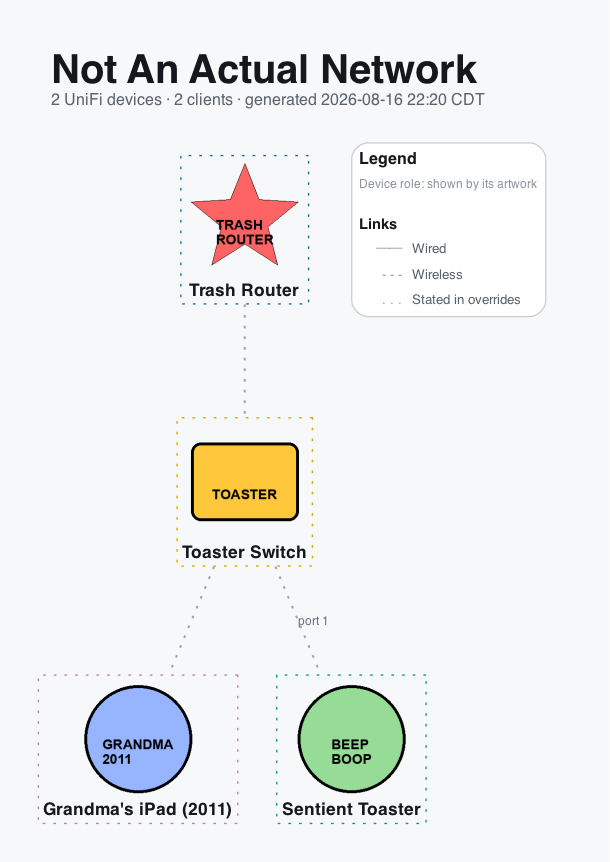

# Drawing a network with no controller at all

[← Documentation index](../README.md#documentation)

**This is not a supported feature.** It is a side effect of how two other
features are built, documented here because it works today and somebody will
find it, not because it is something this project is building toward. Read
[What this is](#what-this-is) before you build anything around it.

## What this is

`unifi-map` normally does one thing: fetch a UniFi controller's own
description of your network, and draw it. The renderer, though, has no idea
where the `Topology` it is handed came from. It is a pure function from a
graph of nodes and edges to a picture, and by the time it runs, the controller
is long gone. Everything upstream of it just happens to be a controller most
of the time.

[Manual overrides](overrides.md) exist to state facts a controller cannot
see: a switch it does not manage, a link it is not in the path of, a VM
living on a particular host. `[[device]]` and `[[link]]`/`[[hosted]]` between
them are already a complete language for declaring nodes and edges by hand.
Nothing stops you from declaring *all* of them, and pointing `--cache-dir` at
a snapshot that reports nothing at all.

So: yes, you can describe an entire network in a TOML file and get a real,
correctly laid out diagram, with your own artwork, having never spoken to a
controller. It is not a trick or an exploit. It falls out of the schema
existing and the renderer not checking.

## Why it will never be officially supported

Nobody designs for this path, and nobody tests it. The overrides schema and
the renderers are fully covered by this project's own tests and its normal
compatibility promise — for their actual purpose, describing what a real
controller could not see about a real network. Using overrides as the *only*
source of truth is not that purpose, and nothing here watches for it. A
future change could break it — a new required field discovered from a real
snapshot, a validation rule tightened, how an empty topology is handled —
without that change being a breaking one from this project's point of view,
and without a line in `CHANGELOG.md` about it.

If you need a network-diagram-as-code tool as your actual job, use one built
for that: [D2](https://d2lang.com/), [Structurizr](https://structurizr.com/),
plain [Graphviz](https://graphviz.org/), or similar. This project's shape,
its `Kind` vocabulary, its artwork pipeline, all of it is decided by what a
UniFi console shows, and that is staying true regardless of what this page
documents.

## How to do it

### 1. A snapshot that reports nothing

`unifi-map render` reads `--cache-dir` and refuses to run without *something*
there. The simplest legitimate snapshot is three files reporting empty lists,
written by hand — no controller, no Python, nothing generated:

```bash
mkdir -p cache
echo '{"data": []}' > cache/device.json
echo '{"data": []}' > cache/client_active.json
echo '{"data": []}' > cache/networkconf.json
```

This is the same flat layout `Snapshot.read()` already falls back to for a
cache written before generations existed, so nothing about it is a hack on
that front. Every node and edge you see afterward comes entirely from your
overrides file.

### 2. Declare the network

```toml
# overrides.toml
[[device]]
name = "Core Switch"
kind = "switch"

[[device]]
name = "Office Laptop"
kind = "wired_client"
parent = "Core Switch"
port = 3

[[device]]
name = "Guest Phone"
kind = "wireless_client"
parent = "Core Switch"
```

`kind` accepts `gateway`, `switch`, `ap`, `bridge`, `wired_client`,
`wireless_client` or `unknown` — see [the full table](overrides.md#device).
A device with no `parent` floats at the top, which is what you want for
whatever is playing the root of your tree.

### 3. Render it

```bash
unifi-map render --cache-dir cache --overrides overrides.toml --icons builtin
```

**Use `--icons builtin`, not the default `--icons unifi`.** The `unifi` icon
set matches hardware by `sysid` and clients by fingerprint `dev_id`, neither
of which exists on a device you typed in yourself, so it would spend time
finding nothing. `builtin` draws the same nine role-shaped icons this project
draws for anything Ubiquiti's catalogue does not recognise, which is a
perfectly good generic node shape for this.

### 4. Your own artwork

`[[device]].icon` (or `[[node]].icon` for something already on the map)
points at any PNG, JPEG, GIF or SVG, resolved relative to the overrides file
itself:

```toml
[[device]]
name = "Core Switch"
kind = "switch"
icon = "icons/core-switch.png"
```

Nothing is fetched, nothing is cached against a lookup key. It is your file,
read and placed, exactly as given.

## What does not work

- **No Internet/cloud node.** `Kind.INTERNET` is deliberately excluded from
  what `[[device]]` can declare — that node is only ever synthesised by
  `build_topology()` from a real device's real uplink. Fake a `kind =
  "unknown"` node with your own cloud icon if you want one; there is no way
  to get the real cloud renderer without a controller behind it.
- **The vocabulary is UniFi's, not a generic one.** No router/firewall/server/
  cloud-provider kinds, no rack or location grouping (not built for real
  networks either — see `TODO.md`), one icon per node rather than a shape
  library.
- **The labels still talk about UniFi devices**, because nothing told them
  not to. The title block on a fabricated map still says "N UniFi devices ·
  M clients", and `--report` still lists sections named after controller
  endpoints (`stat/device`, `stat/sta`) that in this case answered nothing
  because nothing asked them anything. Both are honest, in the sense that
  they describe exactly what the pipeline actually did; neither reads like
  it was written for this use case, because it was not.
- **`overrides check` and `overrides generate` still work**, since they are
  built on the same `Topology`, but their output is calibrated for
  reconciling overrides against a real fetch. Read past the framing.

## Example

Four `[[device]]` blocks, four custom icons, `--icons builtin`, `--layout
tree`, nothing else:



Every icon there is a Pillow script drawing a coloured blob with a label on
it. That is deliberate: nothing about this page should read as an invitation
to make something that looks like a real product diagram out of invented
data. If you use this, make it obviously not that.

## The one sentence to keep

**This works because nothing stops it, not because it is meant to.** Treat it
as a curiosity you are free to use, not a roadmap item, not something to file
an issue about when it eventually breaks.
