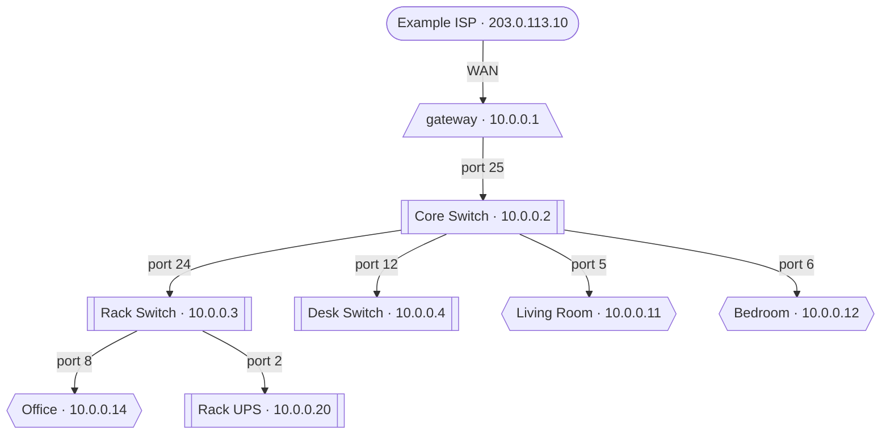

# Output formats and options

[← Documentation index](../README.md#documentation)

Every format `-f` accepts, and the flags that change how a run behaves rather
than what it draws.

| Format | Why |
| --- | --- |
| `svg` | Vector. Zoom to any size, labels stay crisp. Artwork is embedded, so it's one portable file. |
| `pdf` | Vector, for printing. |
| `png` | Raster, when something insists on it. |
| `drawio` | Real editable shapes, pre-positioned with Graphviz's layout. Confirmed working in [draw.io](https://app.diagrams.net). Lucid also documents `.drawio` import, though that has not been tried. |
| `dot` | Graphviz source, to tweak styling by hand. |
| `mermaid` | Text that GitHub, GitLab and most wikis draw in place. No artwork; shape only. [More below](#mermaid-for-documentation). |
| `json` | The normalised topology, for programs rather than people. [More below](#json-for-programs). |

`svg`, `pdf` and `png` need nothing said about them beyond that row: Graphviz
does the drawing, so those three are the formats that require it installed.
`dot`, `mermaid` and `json` are written directly and work without it, which is
worth knowing if you only want the source or the data. `drawio` is in between:
the file is written here, but Graphviz computed the positions in it.

The two text formats below are the ones that need explaining.

## JSON, for programs

```bash
unifi-map render -f json
```

The normalised topology rather than the controller's payloads: nodes, edges,
networks and counts. The model is the stable thing here and UniFi's schemas are
not, so this is what to build an inventory check or a Home Assistant integration
against.

It is also the least dangerous way to hand the data to another program. A cached
snapshot is a full controller dump; this is the graph, and it honours
`--obfuscate`, overrides and `--per-network` exactly as the diagram does, so
whatever cleaning was applied to the picture applies here.

Every top-level key, from the shipped demo. `networks`, `nodes` and `edges` are
abridged to one entry each; `schema`, `generator`, `title` and `counts` are
complete:

```json
{
  "schema": 1,
  "generator": "unifi-map 0.7.2",
  "title": "Network map",
  "counts": {
    "gateway": 1, "switch": 4, "ap": 3, "internet": 1,
    "wired_client": 8, "wireless_client": 11, "unknown": 1
  },
  "networks": [ { "id": "net-lan", "name": "lan", "vlan": 1 } ],
  "nodes": [
    { "id": "02:00:00:00:01:01", "label": "gateway", "kind": "gateway",
      "ip": "10.0.0.1", "model": "UDMPROMAX", "detail": "UDMPROMAX",
      "sysid": 59954 }
  ],
  "edges": [ { "child": "02:00:00:00:01:01", "parent": "internet", "label": "WAN" } ]
}
```

`counts` covers the whole map rather than the abridged arrays above, so it does
not add up to the single node shown. The demo has four networks, not one.

Edges are named `child` and `parent` rather than `src` and `dst`, because a
reader should not have to guess which way round they point. Facts that are not
known are omitted rather than set to `null`, and flags appear only when true.

**The schema may gain fields and will not lose them**, which is what `schema`
tracks. Placement provenance is the obvious addition once it exists.

## Mermaid, for documentation

```bash
unifi-map render -f mermaid --no-clients
```

Writes a `.mmd` that GitHub, GitLab and most wikis draw in place. It is the one
destination the other formats cannot reach: a README cannot embed an SVG that
adapts to the reader's colour scheme, and a draw.io file is not a picture until
somebody opens it.

**The direction follows `--layout`**, as everywhere else: `unifi` (the default)
draws left to right, `tree` draws top to bottom. The file also opens with a
`title` front matter block, which Mermaid renders as a caption.

Below is the shipped demo, infrastructure only, drawn by whatever is showing you
this page. It is the output of

```bash
unifi-map render -f mermaid --no-clients --layout tree
```

with the front matter removed, because a caption on top of a heading reads as a
duplicate of it. Everything else is verbatim:



**It loses all artwork**, necessarily: Mermaid draws boxes and text, so the
product renders that make the SVG worth looking at have nowhere to go. What
survives is the shape, which is what documentation usually wants.

Node kind is carried by shape rather than colour, the same rule the other
backends follow: rounded for the Internet, `[[double]]` for a switch, hexagonal
for an access point. Links keep their meaning too, dashed for wireless and
dotted for anything asserted in an overrides file.

`--no-clients` is doing real work in that example. The full demo is 29 nodes,
which is a wall of boxes on a page; the infrastructure is nine and reads at a
glance.

## Putting a map on a page: `--transparent`

```bash
unifi-map render --transparent --theme dark
```

Draws no canvas, so the diagram sits on whatever is behind it. Applies to SVG,
PDF, PNG and draw.io. Without it, every theme paints a solid background, which
means an SVG dropped into a page is an opaque rectangle whichever theme you
picked.

**The theme still matters, and more than it looks.** With the default
`--icons unifi`, device labels have no card behind them: the artwork is the
node, and the text sits on the canvas. Remove the canvas and every label, edge
label and title lands directly on the destination page, so a light-theme map is
near-invisible on a dark one and vice versa. Match the theme to where the image
is going.

This applies to `--icons builtin` too. It used to be the exception, because the
fallback shapes carried their own fill and kept a background of their own; the
icons that replaced them are transparent PNGs, so nothing behind a node is
filled in and every label sits directly on the destination page.

## Progress, and turning it off

Reading an archive, fetching artwork on a cold cache and running Graphviz on a
large network can each take long enough that a silent terminal looks like a
hang, so a spinner says which step is running.

**It disables itself whenever output is not a terminal.** Piping, redirecting to
a file or running under cron or CI all produce clean text with no escape
sequences, without passing anything. `--no-progress` covers the case that check
cannot see: an interactive terminal whose output something else is reading.

```bash
unifi-map --no-progress all          # never spin
unifi-map all > map.log 2>&1         # already silent, no flag needed
```

Log output goes to stderr with or without the spinner, so neither choice changes
what a script sees. The rendering commands write nothing to stdout at all; their
output is the files they produce. The one exception is `unifi-map shape`, whose
report *is* its output and goes to stdout so it can be piped or redirected.
